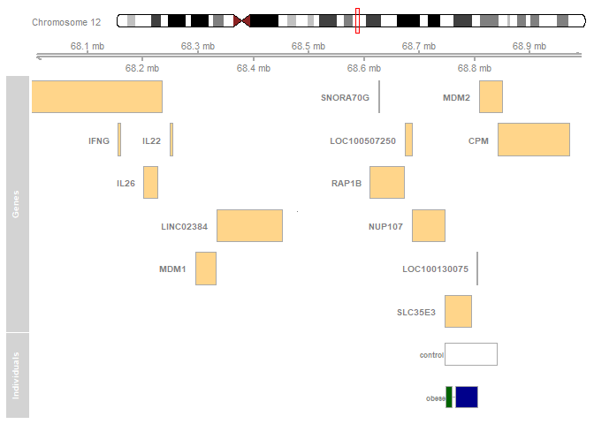

CNV Analysis
================
Isaac De la Hoz and Juan R Gonzalez

Copy number variants detection using *exomeCopy* R package
==========================================================

exomeCopy is an R package implementing a hidden Markov model for predicting copy number variants (CNVs) from exome sequencing experiments without paired control experiments as in tumor/normal sequencing. It models read counts in genomic ranges using negative binomial emission distributions depending on a hidden state of the copy number and on positional covariates such as GC-content and background read depth.Normalization and segmentation are performed simultaneously, eliminating the need for preprocessing of the raw read counts.

Methodology
-----------

### Importing experiment data

Due to we are working with exome data, we have to provide an annotation file defining the exon regions. This information is needed to perform the later analysis. The data was obtained from [UCSC webpage](https://genome.ucsc.edu/cgi-bin/hgTables). It was post-processed through the following code in order to remove non-relevant information and sort the records.

``` bash
cat target_exons.bed | grep -v "chrX[[:space:]]" | grep -v "chrY[[:space:]]" | \
                sort -k 1V,1 -k 2n,2 -k 3n,3 | uniq > AutosomalExons.bed
```

Once we obtained the annotation file, all directories were specified to import the experiment data. All this data were stored as Granges objects.

``` r
library(exomeCopy)
library(GenomicRanges)
setwd("~/data/WES_obesity/CNV")
target.file <- "~/data/WES_obesity/AutosomalExons.bed"
#Sample 12 and 15 are nor included into the anaysis bucause of their bad quality
bam.files <- list.files(path="~/data/WES_obesity/Data", 
                        pattern = ".bam$", full.names = TRUE)[-c(12,15)]
sample.names <- gsub(".bam$", "", (list.files(path="~/data/WES_obesity/Data", 
                                              pattern = ".bam$", 
                                              full.names = FALSE)))[-c(12,15)]
reference.file <- "~/data/WES_obesity/hg38.fa"
target.df <- read.delim(target.file, header = FALSE)
#The target file is converted in a Grange object
target <- GRanges(seqname = target.df[, 1], 
                  IRanges(start = target.df[,2] + 1, end = target.df[, 3]))
target <- sortSeqlevels(target)
```

### Counting reads in genomic ranges

The next step consist in counting reads from the BAM files in genomic ranges covering the targeted regions. The function `countBamInRanges` returns a vector of counts, representing the number of sequenced read starts (leftmost position regardless of strand) with mapping quality above a minimum threshold for each genomic range. The following loop was created in order to count all bam files iteratively.

``` r
counts <- target
for (i in 1:length(bam.files)){
  print(sprintf("Processing %s", sample.names[i]))
  mcols(counts)[[sample.names[i]]]<-countBamInGRanges(bam.files[i],target)
}
```

### Calculating GC-content and background depth

In order to perform the function `exomeCopy` it is necessary to calculate the GC-content and the background depth. The function `getGContent` was used to calculate it.

``` r
counts$GC <- getGCcontent(target, reference.file)
```

Once the GC-content was calculated, the background read depth was generated through a simple function which performs 3 simple steps:

-   Given a vector of names of samples to be used as background, extract the read counts data frame from the GRanges object.

-   It divide each sample by its mean read count (column means).

-   It calculate the median of these normalized read counts (row medians)

The relationship between read counts and GC-content over the ranges varies across protocols and samples. It can be roughly approximated per sample using second-order polynomial terms of GC-content. We store the square of GC-content as a new value column. Other functions of GC-content could be used as well. We also store the width of the ranges as a value column.

``` r
counts$GC.sq <- counts$GC^2
counts$bg <- generateBackground(sample.names, counts, median)counts$GC.sq <- counts$GC^2
counts$bg <- generateBackground(sample.names, counts, median)
## All zero background coverage records are removed in order to avoid further problems
counts2 <- counts[counts$bg >0,]
counts2$log.bg <- log(counts$bg + 0.1)
counts2$width <- width(counts2)
```

### Running `exomeCopy` model

Once we had calculated all parameters before explained, we were able to run the exome copy function. This function is designed to process one chromosome of one sample each time. Considering that, the following wrapper function was created in order to loop `exomeCopy` over all samples and chromosomes.

``` r
runExomeCopy <- function(sample.name, seqs) {
  lapply(seqs, function(seq.name) exomeCopy(counts2[seqnames(counts2) == seq.name], 
                                            sample.name, X.names = 
                                              c("log.bg","GC", "GC.sq", "width"), S = 0:4, d = 2))
}
seqs<-seqlevels(counts2)
fit.list <- lapply(sample.names, runExomeCopy, seqs)
```

After fitting, we call the function `compileCopyCountSegments` on the ExomeCopy object, which provides the segmentation with the predicted copy number, the log odds of read counts being emitted from predicted copy count over normal copy count, the number of input genomic ranges contained within each segment, the number of targeted basepairs contained in the segments, and the name of the sample to help compile the segments across samples.

``` r
compiled.segments <- compileCopyCountSegments(fit.list)
#The result Grange object looks life this:
```

``` r
head(compiled.segments)
```

    ## GRanges object with 6 ranges and 5 metadata columns:
    ##       seqnames        ranges strand | copy.count  log.odds   nranges
    ##          <Rle>     <IRanges>  <Rle> |  <integer> <numeric> <numeric>
    ##   [1]     chr1   12975-17368      * |          2         0         6
    ##   [2]     chr1   17369-70005      * |          4     10.77         6
    ##   [3]     chr1 131025-187577      * |          2         0        11
    ##   [4]     chr1 188130-925800      * |          0     28.24        63
    ##   [5]     chr1 925741-925800      * |          2         0         1
    ##   [6]     chr1 925922-947060      * |          4      8.36        62
    ##       targeted.bp sample.name
    ##         <integer> <character>
    ##   [1]        <NA>      141276
    ##   [2]        <NA>      141276
    ##   [3]        <NA>      141276
    ##   [4]        <NA>      141276
    ##   [5]        <NA>      141276
    ##   [6]        <NA>      141276
    ##   -------
    ##   seqinfo: 22 sequences from an unspecified genome; no seqlengths

Overlap analysis of CNVs with functional genomic regions
========================================================

From the output obtained from exomeCopy we could distinguish which region was under or over-represented according to the copy count number. The annotation with a copy count number different to 2 (the normal count number for diploid organism) were considering as over represented (copy count higher than 2) or under represented (copy count lower than 2). Considering this premise, we selected all annotation with a copy count different than 2 and we discarded all non-useful information for the later analysis.

``` r
finalCNV<- as.data.frame(compiled.segments[c("sample.name", "copy.count")])
names(finalCNV)[7]<-"state"
finalCNV<-finalCNV[,c(1,2,3,6,7)]
finalCNV<-finalCNV[finalCNV$state!=2,]
#We group the calls by sample ID, resulting in a GRangesList.
grl <- makeGRangesListFromDataFrame(finalCNV, 
                                    split.field="sample.name", keep.extra.columns=TRUE)
#The Grangelist looks like this:
```

``` r
grl
```

    ## GRangesList object of length 15:
    ## $141276 
    ## GRanges object with 11063 ranges and 1 metadata column:
    ##           seqnames            ranges strand |     state
    ##              <Rle>         <IRanges>  <Rle> | <integer>
    ##       [1]     chr1       17369-70005      * |         4
    ##       [2]     chr1     188130-925800      * |         0
    ##       [3]     chr1     925922-947060      * |         4
    ##       [4]     chr1     970277-975108      * |         4
    ##       [5]     chr1     974573-998051      * |         0
    ##       ...      ...               ...    ... .       ...
    ##   [11059]    chr22 50577775-50578659      * |         0
    ##   [11060]    chr22 50580565-50623326      * |         1
    ##   [11061]    chr22 50678585-50777981      * |         1
    ##   [11062]    chr22 50777952-50780718      * |         0
    ##   [11063]    chr22 50783039-50801309      * |         0
    ## 
    ## ...
    ## <14 more elements>
    ## -------
    ## seqinfo: 22 sequences from an unspecified genome; no seqlengths

Summarizing individual CNV calls across a population
----------------------------------------------------

In CNV analysis, it is often of interest to summarize individual calls across the population, (i.e. to define CNV regions), for subsequent association analysis with expression and phenotype data. In the simplest case, this just merges overlapping individual calls into summarized regions. In this case, we used the approach from CNVRuler to summarize CNV calls to CNV regions. This trims low-density areas as defined by the density argument, which is set here to &lt;10% of the number of calls within a summarized region.

``` r
##CNVRANger. CNV Enrichment 
library(CNVRanger)
grlCNV<-sort(grl)
cnvrs <- populationRanges(grlCNV, density=0.1)
cnvrs
```

    ## GRanges object with 1457 ranges and 2 metadata columns:
    ##          seqnames              ranges strand |      freq        type
    ##             <Rle>           <IRanges>  <Rle> | <numeric> <character>
    ##      [1]     chr2     8860695-8861142      * |         4        both
    ##      [2]     chr2     8862271-8862722      * |         5        both
    ##      [3]     chr2     8864170-8864234      * |         4        both
    ##      [4]     chr2     8868446-8868549      * |         4        both
    ##      [5]     chr2     8873108-8873300      * |         4        both
    ##      ...      ...                 ...    ... .       ...         ...
    ##   [1453]    chr12 133238455-133238549      * |         2        loss
    ##   [1454]    chr13   20403666-20406128      * |         6        both
    ##   [1455]    chr13   20432102-20567785      * |        13        both
    ##   [1456]    chr17       118383-118578      * |         1        loss
    ##   [1457]    chr19         70652-70976      * |         3        loss
    ##   -------
    ##   seqinfo: 22 sequences from an unspecified genome; no seqlengths

All this anlysis is perfeormed using control data taken from Iberian population from 1000 genome project. The data for control looks like this:

``` r
load(file = "Data/cnvControls.rda")
cnvrControl
```

    ## GRanges object with 10763 ranges and 3 metadata columns:
    ##           seqnames            ranges strand |      freq        type
    ##              <Rle>         <IRanges>  <Rle> | <numeric> <character>
    ##       [1]     chr1   1955148-1955523      * |         4        loss
    ##       [2]     chr1   1955691-1990975      * |        11        loss
    ##       [3]     chr1   2185175-2185190      * |         8        both
    ##       [4]     chr1   2185281-2185395      * |         7        both
    ##       [5]     chr1 13148905-13165467      * |         8        both
    ##       ...      ...               ...    ... .       ...         ...
    ##   [10759]    chr22 50529710-50529754      * |         5        loss
    ##   [10760]    chr22 50530409-50541456      * |        10        both
    ##   [10761]    chr22 50547568-50556432      * |        13        both
    ##   [10762]    chr22 50780613-50780718      * |        12        both
    ##   [10763]    chr22 50782769-50784072      * |        12        loss
    ##                  caco
    ##           <character>
    ##       [1]     control
    ##       [2]     control
    ##       [3]     control
    ##       [4]     control
    ##       [5]     control
    ##       ...         ...
    ##   [10759]     control
    ##   [10760]     control
    ##   [10761]     control
    ##   [10762]     control
    ##   [10763]     control
    ##   -------
    ##   seqinfo: 22 sequences from an unspecified genome; no seqlengths

Enrichmen by genomic ranges
---------------------------

Once individual CNV calls have been summarized across the population, it is typically of interest whether the resulting CNV regions overlap with functional genomic regions such as genes, promoters, or enhancers. As a certain amount of overlap can be expected just by chance, an assessment of statistical significance is needed to decide whether the observed overlap is greater (enrichment) or less (depletion) than expected by chance.

The `regioneR` package implements a general framework for testing overlaps of genomic regions based on permutation sampling. This allows to repeatedly sample random regions from the genome, matching size and chromosomal distribution of the region set under study (here: the CNV regions). By recomputing the overlap with the functional features in each permutation, statistical significance of the observed overlap can be assessed.

In the following code we extracted the annotations of protein coding genes from `AnnotationHub` in order to prove if the tool works properly with our data.

``` r
library(AnnotationHub)
ah <- AnnotationHub()
ahDb <- query(ah, pattern = c("Homo Sapiens", "EnsDb"))
ahEdb <- ahDb[["AH69187"]]
#Interesting regions
##Genes
hg.genes <- genes(ahEdb)
sel.genes <- hg.genes[hg.genes$gene_biotype == "protein_coding"]
seqlevelsStyle(sel.genes)<-"UCSC"
```

Once we had the annotations, we performed the test with 10000 permutations (ntimes=10000), while maintaining chromosomal distribution of the CNV region set (per.chromosome=TRUE). Furthermore, we used the option count.once=TRUE to count an overlapping CNV region only once, even if it overlaps with 2 or more genes. We also allowed random regions to be sampled from the entire genome (mask=NA).

``` r
library(regioneR)
library(BSgenome.Hsapiens.UCSC.hg38.masked)
res <- suppressWarnings(overlapPermTest(A=cnvrs, B=sel.genes, ntimes=1000, 
                                        genome="BSgenome.Hsapiens.UCSC.hg38.masked", 
                                        mask=NA, per.chromosome=TRUE, count.once=TRUE))
res
```

    ## $numOverlaps
    ## P-value: 0.000999000999000999
    ## Z-score: 32.188
    ## Number of iterations: 1000
    ## Alternative: greater
    ## Evaluation of the original region set: 1386
    ## Evaluation function: numOverlaps
    ## Randomization function: randomizeRegions
    ## 
    ## attr(,"class")
    ## [1] "permTestResultsList"

Finding Relevant CNVs comparing case with controls
==================================================

First of all, we need to add a column with the data name (case or control) and to find those overlaping CNVs between case and control

``` r
cnvrs$caco <- "obese"
cnvrControl$caco <- "control"
gr.common <- subsetByOverlaps(cnvrs, cnvrControl)
```

Once we have defined the overlaping CNVs, we need to define the function to evaluate the significance of each overlaping CNV comparing the frequency of each CNV between case and control through fisher test:

``` r
testCNV <- function(x, n=c(15, 15)) {
  tt <- matrix(c(x[1], n[1] - x[1], x[2], n[2] - x[2]), ncol=2)
  ans <- try(fisher.test(tt), TRUE)
  if (inherits(ans, "try-error"))
    out <- NA
  else
    out <- ans$p.value
  out
}
#We define a loop in order to evaluate the significance of each
#overlaping CNV
out <- list()
freqControl<- list()
typeControl<- list()
for (i in 1:length(gr.common)){
  obs <- c(NA, NA)
  obs[1] <- subsetByOverlaps(cnvrs, gr.common[i])$freq
  obs[2] <- subsetByOverlaps(cnvrControl, gr.common[i])$freq
  freqControl[[i]]<-obs[2]
  typeControl [[i]]<- subsetByOverlaps(cnvrControl, gr.common[i])$type[1]
  out[[i]] <- testCNV(obs)
}
gr.common$freqControl <- unlist(freqControl)
gr.common$typeControl <- unlist(as.vector(typeControl))
pvals <- unlist(out)
gr.common$p.values <- pvals 
#The p-value is ajusted by the Benjamini, Hochberg method
gr.common$padj <- p.adjust(pvals, method="BH")
#The resulting object looks like this
gr.common
```

    ## GRanges object with 154 ranges and 7 metadata columns:
    ##         seqnames              ranges strand |      freq        type
    ##            <Rle>           <IRanges>  <Rle> | <numeric> <character>
    ##     [1]     chr2   69963462-69963500      * |        11        both
    ##     [2]     chr2   69996858-69996888      * |        14        both
    ##     [3]     chr2   70086124-70086245      * |        15        loss
    ##     [4]     chr2 157325643-157325662      * |         5        both
    ##     [5]     chr2 189791700-189795951      * |         4        both
    ##     ...      ...                 ...    ... .       ...         ...
    ##   [150]    chr12 121453120-121494521      * |         2        loss
    ##   [151]    chr12 121509943-121524795      * |         6        both
    ##   [152]    chr12 121536020-121536128      * |         3        loss
    ##   [153]    chr12 121579627-121651644      * |        10        both
    ##   [154]    chr12 133193428-133214831      * |         9        both
    ##                caco freqControl typeControl             p.values
    ##         <character>   <numeric> <character>            <numeric>
    ##     [1]       obese           4        loss   0.0268377292262022
    ##     [2]       obese           5        loss  0.00169915042478761
    ##     [3]       obese           7        both  0.00219890054972513
    ##     [4]       obese           6        both                    1
    ##     [5]       obese           6        both    0.699850074962519
    ##     ...         ...         ...         ...                  ...
    ##   [150]       obese          15        both 1.75350921030713e-06
    ##   [151]       obese          15        both 0.000699650174912543
    ##   [152]       obese          15        both 1.05210552618428e-05
    ##   [153]       obese          15        both   0.0421455938697318
    ##   [154]       obese          14        both   0.0800766283524905
    ##                         padj
    ##                    <numeric>
    ##     [1]   0.0536754584524045
    ##     [2]  0.00545144094619358
    ##     [3]  0.00627093860477167
    ##     [4]                    1
    ##     [5]    0.798176628471334
    ##     ...                  ...
    ##   [150] 6.75101045968245e-05
    ##   [151]  0.00234230710731591
    ##   [152]  0.00011573160788027
    ##   [153]   0.0737547892720306
    ##   [154]    0.129808429118774
    ##   -------
    ##   seqinfo: 22 sequences from an unspecified genome; no seqlengths

We proceed to anotate the genes where these CNV overlaps:

``` r
###Annotating genes
#Extracting gene names and their genomic positions
library(Homo.sapiens.hg38)
geneRanges <- 
  function(db, column="ENTREZID")
  {
    g <- genes(db, columns=column)
    col <- mcols(g)[[column]]
    genes <- granges(g)[rep(seq_along(g), elementNROWS(col))]
    mcols(genes)[[column]] <- as.character(unlist(col))
    genes
  }

splitColumnByOverlap <-
  function(query, subject, column="ENTREZID", ...)
  {
    olaps <- findOverlaps(query, subject, ...)
    f1 <- factor(subjectHits(olaps),
                 levels=seq_len(subjectLength(olaps)))
    splitAsList(mcols(query)[[column]][queryHits(olaps)], f1)
  }
gns <- geneRanges(Homo.sapiens.hg38, column="SYMBOL")

#Merging genes positions with SNPs' genomics positions
seqlevelsStyle(gr.common)<-seqlevelsStyle(gns)
genome(gr.common)<-genome(gns)
symInCnv = splitColumnByOverlap(gns, gr.common, "SYMBOL")
geneNames<-as.vector(unstrsplit(symInCnv, sep=", "))
gr.common$GENES <- geneNames
#we can see the significants CNVs
gr.commonSig<- gr.common[gr.common$padj<=0.05]
#The most significant CNVs
gr.common[gr.common$padj==(min(gr.commonSig$padj))]
```

    ## GRanges object with 4 ranges and 8 metadata columns:
    ##       seqnames              ranges strand |      freq        type
    ##          <Rle>           <IRanges>  <Rle> | <numeric> <character>
    ##   [1]    chr12     1800007-1800052      * |         2        both
    ##   [2]    chr12   68747930-68759239      * |         2        gain
    ##   [3]    chr12   68764888-68805479      * |         2        loss
    ##   [4]    chr12 121453120-121494521      * |         2        loss
    ##              caco freqControl typeControl             p.values
    ##       <character>   <numeric> <character>            <numeric>
    ##   [1]       obese          15        both 1.75350921030713e-06
    ##   [2]       obese          15        both 1.75350921030713e-06
    ##   [3]       obese          15        both 1.75350921030713e-06
    ##   [4]       obese          15        both 1.75350921030713e-06
    ##                       padj                 GENES
    ##                  <numeric>           <character>
    ##   [1] 6.75101045968245e-05              CACNA2D4
    ##   [2] 6.75101045968245e-05               SLC35E3
    ##   [3] 6.75101045968245e-05 LOC100130075, SLC35E3
    ##   [4] 6.75101045968245e-05                 KDM2B
    ##   -------
    ##   seqinfo: 22 sequences from hg38 genome; no seqlengths

Finally, we can visualize the most significant CNVs using the GViz package and the plotCNVs function from Genome Alteration Detection Algorithm (GADA) package.

``` r
###Ploting genemoic features where the significants CNV are located

library(Gviz)
library(Homo.sapiens.hg38)
library(gada)

##PlotsCNVs code. Some modifications are needed in order to make it work with our data

plotCNVs <- function(x, range, genome="hg38", drawGenes=FALSE,
                     col.cnvs = c("darkgreen", "darkblue"),
                     mosaic = FALSE){
  if(missing(range))
    stop("a GenomicRange should be passed from 'range' argument")
  
  Imp8<-GRanges()
  Imp6<-GRanges()
  for (i in 1:length(x)){
    for (j in 1:x[i]$freq){
      Imp6[j]<-x[i]
      Imp8<-c(Imp8,Imp6[j])
    }
  }
  chr <- as.character(seqnames(range))
  cnvs.range <- subsetByOverlaps(Imp8, range)
  
  fill <- ifelse(cnvs.range$caco=="obese", col.cnvs[1],
                 ifelse(cnvs.range$caco=="control", col.cnvs[2],"black")) 
  
  cnvs.l <- AnnotationTrack(cnvs.range[cnvs.range$caco=="obese"], 
                            fill = fill[1:length(cnvs.range[cnvs.range$caco=="obese"])],
                            name = "Cases",
                            cex.group=1, width = 1)
  cnvs <- AnnotationTrack(cnvs.range[cnvs.range$caco=="control"], 
                            fill = fill[length(cnvs.range[cnvs.range$caco=="obese"]):length(cnvs.range)],
                            name = "Controls",
                            cex.group=1, width = 1)
  gtrack <- GenomeAxisTrack()
  itrack <- IdeogramTrack(genome = genome, 
                          chromosome = chr)
  if (drawGenes) {
    if (genome=="hg19" & requireNamespace("TxDb.Hsapiens.UCSC.hg19.knownGene")) {
      txdb <- TxDb.Hsapiens.UCSC.hg19.knownGene
    }
    else if (genome=="hg38" & requireNamespace("TxDb.Hsapiens.UCSC.hg38.knownGene"))
      txdb <- TxDb.Hsapiens.UCSC.hg38.knownGene
    else {
      warning("Genes are not shown since TxDb database is not installed in you computer")
      drawGenes <- FALSE
    }  
  } 
  
  if(drawGenes) {
    allg <- genes(txdb)
    allg.range <- subsetByOverlaps(allg, range)
    allg.range$symbol <- mapIds(Homo.sapiens.hg38::Homo.sapiens.hg38, 
                                keys=allg.range$gene_id,
                                keytype="ENTREZID",
                                column="SYMBOL")
    
    
    grtrack <- GeneRegionTrack(allg.range, genome = genome,
                               chromosome = chr, showId=TRUE,
                               geneSymbol=TRUE,
                               start = start(range), 
                               end = end(range),
                               name = "Genes")
    
    plotTracks(c(itrack, gtrack, grtrack, cnvs.l, cnvs), 
              from = start(range),
               to = end(range))
  }
  else{
    plotTracks(c(itrack, gtrack, cnvs.l, cnvs), 
               from = start(rr),
               to = end(rr))
  }
}
#we prove in a region rich in CNVs
rr5<-GRanges("chr12:27e6-32e6")
Imp5<-c(gr.commonSig,subsetByOverlaps(cnvrControl,gr.commonSig))
Imp5<-Imp5[width(Imp5)>199]
plotCNVs(Imp5, range=rr5, drawGenes = TRUE, genome="hg38", 
         mosaic = TRUE, col.cnvs = c("black", "white"))
```


